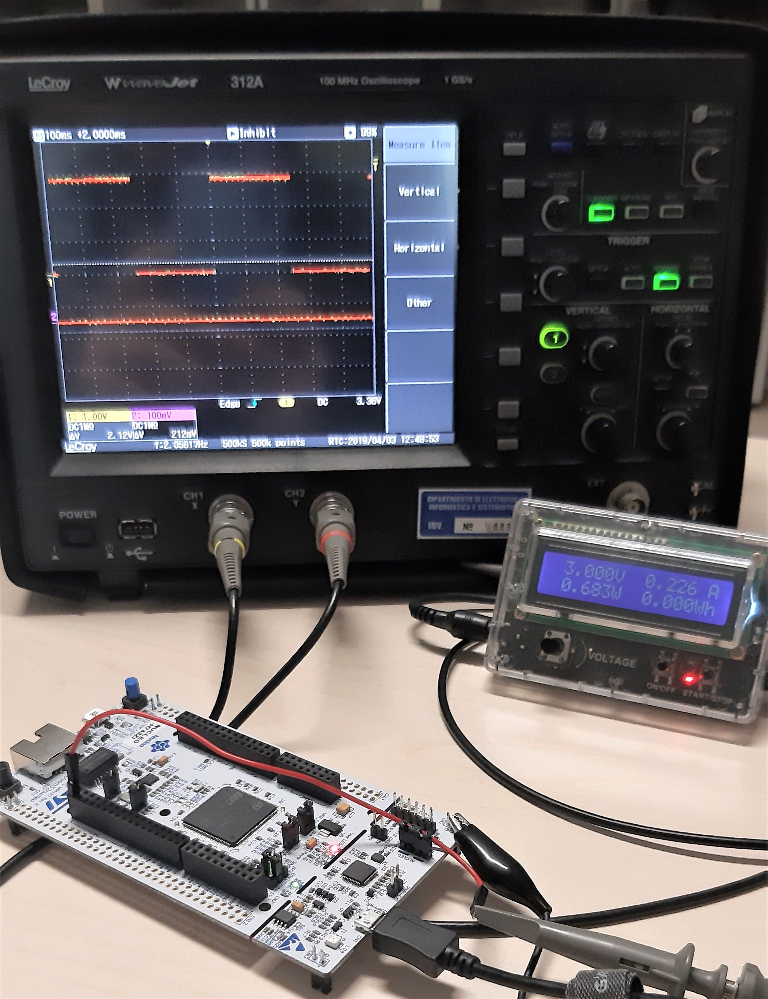

# Mobilenet on STMH7 using STMCubeMX.AI
(new version is located here: https://github.com/alessandrocapotondi/MobileNet_v1_x_cube_ai_4.1.0)

The repo contains a STMWorkbench project that aims to fit a [Mobilenet v1](https://github.com/tensorflow/models/blob/master/research/slim/nets/mobilenet_v1.md) (`3,128,128`, alpha=`0.25`) into a MCU STM32H7 using the STMCubeMX.AI flow. Note that the selected Mobilenet version is the biggest model that can be fitted on the MCU STM32H7 using the STMCubeMX.AI flow.

This project will be used as reference benchmark of our **Quantized Mobilenet** based on`CMSIS-NN`: https://github.com/EEESlab/mobilenet_v1_stm32_cmsis_nn

## Current Status
Mobilenet v1 (`3,128,128`, alpha=`0.25`) **compiles and works** on 
[STMicroelectronics STM32 Nucleo-144](https://www.st.com/en/evaluation-tools/nucleo-f429zi.html).

## Content
The project folder structure follows the classic STMWorkbench project template. In addition it contains the code generated by STMCubeMX.AI for the Mobilenet included inside the folder `keras_model/`:
- `Drivers/`: *(generated)* The Folder contains the ARM `CMSIS` and additional drivers for the MCU;
- `Middlewares/ST/AI/AI/`: *(generated)* `STMCubeMX.AI` generated code for the Mobilenet.
- `Src/`: *(generated)* Sources.
- `Inc/usr_mobilenet.h`: user-space header file for Mobilenet application execution.
- `Src/usr_mobilenet.c`: user-space applications and utilities for Mobilenet application execution.
- `keras_model/`: The folder contains a Python notebook used to fix and convert the Keras Mobilenet pre-trained model to a model that can be imported into the STMCubeMX.AI flow. According to the discussion [\[1\]](https://community.st.com/s/question/0D50X0000AVUpc1SQD/keras-import-not-implemented-unsupported-layer-type-relu), *keras.advanced_activations.ReLU* layers are not usable directly in STCubemx.ai. The function remove such layers and it substitutes to supported *keras.activations.relu*.
- `mobilenet_cubemx_ai.ioc`: STMCubeMX project file.

## Measured Performances
Million MACs | Million Parameters | Top-1 Accuracy| Top-5 Accuracy | CPU Cycles (MCycles)| Latency @400MHz (s)| MMACs/s | MMACs/s/W* |
:------------:|:----------:|:-------:|:-------:|:-------:|:-------:|:-------:|:-------:|
14|0.47|41.5|66.3|99|0.247|56.7|84.6|

* This number refers to an average power consumption of `0.68` Watt measured at the power source, so it CANNOT be considered as efficiency metric of the MCU, but it is the efficiency of this particular solution, which includes LED activations, GPIO triggering, and all the other peripherals on the board.

## Execution Screenshot

  

